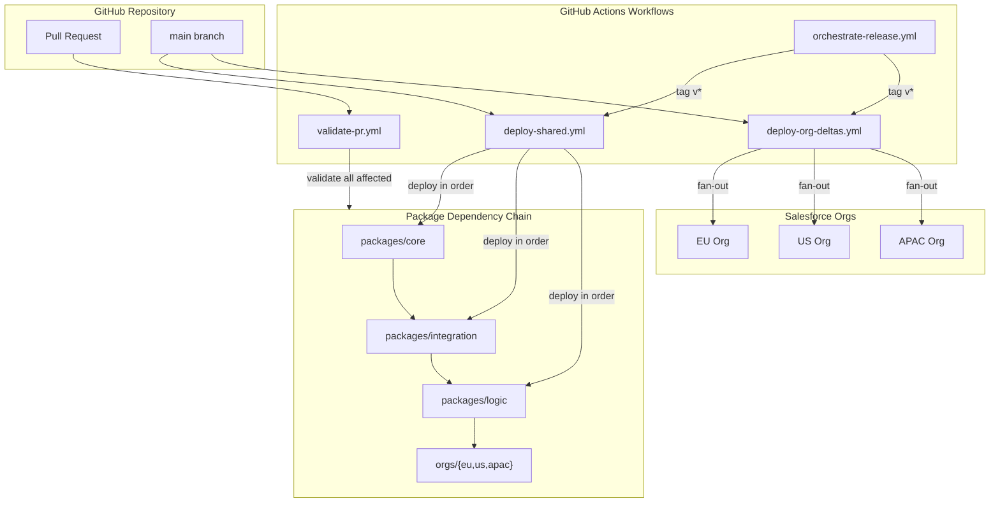

# TDX 2026 — Design a DevOps Strategy for Multi-Org Implementations

> A production-ready blueprint for repo-driven Salesforce delivery across multiple orgs.

[](LICENSE)
[](https://developer.salesforce.com/docs/atlas.en-us.api_rest.meta/api_rest/)
[](https://github.com/features/actions)

---

## Architecture Overview


<details>
<summary>Pipeline-level flow (Mermaid)</summary>



</details>

## Quick Start

```bash
# 1. Fork and clone the repository
gh repo fork christopherramm/TDX-2026-Salesforce-DevOps-Multi-Org --clone
cd TDX-2026-Salesforce-DevOps-Multi-Org

# 2. Authenticate with your Dev Hub
sf org login web --set-default-dev-hub --alias devhub

# 3. Create scratch orgs for each region
sf org create scratch -f config/project-scratch-def.json -a eu-scratch -d 7
sf org create scratch -f config/project-scratch-def.json -a us-scratch -d 7
sf org create scratch -f config/project-scratch-def.json -a apac-scratch -d 7

# 4. Deploy shared packages (in dependency order)
sf project deploy start -d packages/core    -o eu-scratch
sf project deploy start -d packages/integration -o eu-scratch
sf project deploy start -d packages/logic   -o eu-scratch

# 5. Deploy org-specific metadata
sf project deploy start -d orgs/eu -o eu-scratch

# 6. Run smoke tests
./scripts/smoke-test.sh eu-scratch
```

See [docs/SETUP-GUIDE.md](docs/SETUP-GUIDE.md) for the full walkthrough including CI/CD configuration, or check the [HOW-TO Guide](HOW-TO.md) for common tasks and recipes.

## Repository Structure

```
TDX-2026-Salesforce-DevOps-Multi-Org/
├── .github/
│   ├── workflows/
│   │   ├── validate-pr.yml          # PR validation — runs on every pull request
│   │   ├── deploy-shared.yml        # Deploy shared packages to all orgs
│   │   ├── deploy-org-deltas.yml    # Deploy org-specific changes (fan-out)
│   │   └── orchestrate-release.yml  # Full release orchestration (tag-triggered)
│   └── PULL_REQUEST_TEMPLATE.md     # Standardized PR template
├── config/
│   ├── org-registry.json            # Org aliases, auth secret names, regions
│   └── deployment-order.json        # Package dependency and deployment sequence
├── packages/
│   ├── core/                        # Shared foundation — data model, utilities
│   │   └── main/default/
│   ├── integration/                 # Shared integration layer — APIs, platform events
│   │   └── main/default/
│   └── logic/                       # Shared business logic — services, triggers
│       └── main/default/
├── orgs/
│   ├── eu/                          # EU-specific metadata and overrides
│   │   └── main/default/
│   ├── us/                          # US-specific metadata and overrides
│   │   └── main/default/
│   └── apac/                        # APAC-specific metadata and overrides
│       └── main/default/
├── scripts/
│   ├── detect-changes.sh            # Change detection — maps files to packages/orgs
│   └── smoke-test.sh                # Post-deployment smoke tests
├── docs/
│   ├── ARCHITECTURE.md              # Architecture models and decision rationale
│   ├── DECISION-LOG.md              # Architecture Decision Records (ADRs)
│   └── SETUP-GUIDE.md              # Step-by-step setup instructions
├── sfdx-project.json                # Salesforce DX project definition
└── LICENSE                          # MIT license
```

## Delivery Approach Reference

Multi-org DevOps is not a one-size-fits-all problem. The right delivery approach depends on how the enterprise operates — specifically, where it sits on the MIT-CISR / SOGAF operating model matrix (Unification, Coordination, Replication, Diversification). A highly unified enterprise with standardized processes will lean toward package-based delivery; a coordinated or diversified enterprise with autonomous business units will gravitate toward repo-driven delivery. Both approaches are architecturally sound — the decision is organizational, not technical.

### Approach A — Package-Based Delivery

Package-based delivery treats unlocked packages as the unit of deployment. Each metadata layer gets its own scope, versioning, and upgrade cadence.

| Package layer | Scope | Versioning | Upgrade cadence |
|---|---|---|---|
| **Core platform** · Data model, security, base objects | **Shared** · Installed in all orgs identically | Strict semantic versioning · Breaking changes = major bump | Quarterly release train · Aligned with SF releases |
| **Integration layer** · Named creds, external services, events | **Shared** · Contracts must be consistent cross-org | API-contract versioning · Backward-compatible by default | On-demand + coordinated · Triggered by API changes |
| **Business logic** · Flows, Apex, automation, agents | **Hybrid** · Shared base + org-specific extensions | Feature-branch per org · Shared base locked; extensions float | Continuous for extensions · Shared base follows core cadence |
| **UI components** · LWC, Flexipages, app config | **Org-specific** · Each org has its own UX needs | Org-level versioning · No cross-org version sync needed | Continuous delivery · Local teams release independently |
| **Compliance & regulatory** · Audit trails, data residency, GDPR | **Hybrid** · Global framework + local regulatory config | Immutable releases · Audit trail per version mandatory | Policy-driven · Deployed when regulation changes |

---

### Approach B — Repo-Driven Delivery

Repo-driven delivery uses the Git repository as the single source of truth. The key decisions are where metadata lives in the repo, how branches are managed, and what triggers a deployment.

| Metadata layer | Repo structure | Branch strategy | Deployment trigger |
|---|---|---|---|
| **Core platform** · Data model, security, base objects | `packages/core` · Single source of truth across all orgs | Trunk-based on `main` · No org-specific forks allowed | Merge to `main` · Triggers deploy to all orgs sequentially |
| **Integration layer** · Named creds, external services, events | `packages/integration` · Tightly coupled with core | Trunk-based, pinned to API versions · Contract-first approach | After core, before org deltas · Order enforced by pipeline |
| **Business logic** · Flows, Apex, automation, agents | `packages/logic` + `orgs/{region}/logic` · Shared base + org overrides | Feature branches → `main` · Org branches for overrides | Shared: with core cadence · Overrides: continuous per org |
| **UI components** · LWC, Flexipages, app config | `orgs/{region}/ui` · Fully org-specific directories | Long-lived org branches · Or org-scoped dirs on `main` | Continuous delivery · Local teams push independently |
| **Compliance & regulatory** · Audit trails, data residency, GDPR | `packages/compliance` + `orgs/{region}/` · Global framework + local config | Protected branch · Compliance team approval on every PR | Policy-driven · Deployed when regulation changes |

---

The two approaches are not mutually exclusive. Many enterprises use package-based delivery for shared core components (where version control and install order matter) and repo-driven delivery for org-specific extensions (where speed and local autonomy matter). This repository demonstrates primarily the repo-driven approach, but the package layering principles — core → integration → logic → org-specific — apply identically to both.

## Workflows

| Workflow | Trigger | Purpose |
|----------|---------|---------|
| [validate-pr.yml](.github/workflows/validate-pr.yml) | Pull request to `main` | Detects changed packages/orgs, validates metadata, runs Apex tests in scratch orgs |
| [deploy-shared.yml](.github/workflows/deploy-shared.yml) | Push to `main` (shared packages) | Deploys `core` → `integration` → `logic` sequentially to all orgs |
| [deploy-org-deltas.yml](.github/workflows/deploy-org-deltas.yml) | Push to `main` (org paths) | Fans out org-specific deployments in parallel to affected orgs only |
| [orchestrate-release.yml](.github/workflows/orchestrate-release.yml) | Tag push `v*` | Full release: shared packages → org deltas → smoke tests → notification, with approval gates |

All workflows use the [detect-changes.sh](scripts/detect-changes.sh) script to determine which packages and orgs are affected by a given changeset, ensuring that only the necessary deployments are triggered.

## Configuration Reference

### org-registry.json

Defines every Salesforce org managed by this repository.

```jsonc
{
  "orgs": [
    {
      "name": "eu",
      "alias": "eu-sandbox",
      "auth_secret": "SFDX_AUTH_URL_EU",       // GitHub secret name
      "region": "Europe",
      "environment": "eu-sandbox"               // GitHub Environment name
    }
    // ... us, apac
  ]
}
```

### deployment-order.json

Controls the sequence in which shared packages are deployed, respecting dependency relationships.

```jsonc
{
  "shared_packages": [
    { "name": "core",        "path": "packages/core" },
    { "name": "integration", "path": "packages/integration" },
    { "name": "logic",       "path": "packages/logic" }
  ]
}
```

## Contributing

1. **Branch from `main`** — use short-lived feature branches: `feature/your-change`
2. **Keep changes scoped** — avoid mixing shared package and org-specific changes in one PR when possible
3. **Write tests** — every Apex class in `packages/` should have a corresponding `*Test` class
4. **Use the PR template** — it guides you through the required sections
5. **Let CI validate** — do not merge until all checks pass

See [docs/DECISION-LOG.md](docs/DECISION-LOG.md) for the rationale behind our branching and CI strategy.

## About This Session

This repository accompanies the **TrailblazerDX 2026** (TDX) session:

> **Design a DevOps Strategy for Multi-Org Implementations**

The session explores how to structure a single repository to manage metadata across multiple Salesforce orgs — handling shared packages, org-specific overrides, and fan-out deployments through GitHub Actions.

Whether you run two orgs or twenty, the patterns in this blueprint scale from sandbox validation all the way to production delivery.

[TrailblazerDX 2026](https://reg.salesforce.com/flow/plus/tdx26/sessioncatalog/page/catalog/session/1770914049401001a8hh)

## Author

**Christopher Ramm**
DCX CTO Germany @ Capgemini | Salesforce CTA | Salesforce MVP

## Disclaimer

Built with AI assistance
This repository was developed with support from AI tools (Claude by Anthropic) for code generation, documentation, and architecture documentation. All content has been reviewed, validated, and curated by the author. The architectural decisions, patterns, and recommendations reflect real-world enterprise experience.

## License

This project is licensed under the [MIT License](LICENSE).
