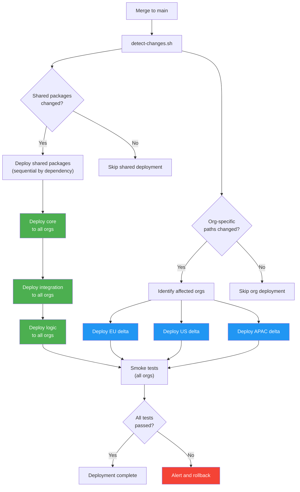

# Architecture: Multi-Org DevOps Models

This document describes the three primary architecture models for managing Salesforce metadata across multiple orgs with source-driven DevOps, explains why this repository follows the **Federated Model**, and details the package layering strategy and fan-out deployment pattern.

---

## Table of Contents

- [Three Architecture Models](#three-architecture-models)
  - [1. Independent Model](#1-independent-model)
  - [2. Federated Model](#2-federated-model-this-repo)
  - [3. Unified Model](#3-unified-model)
- [Decision Matrix](#decision-matrix)
- [Package Layering Strategy](#package-layering-strategy)
- [Fan-Out Deployment Pattern](#fan-out-deployment-pattern)
- [Deployment Flow Diagram](#deployment-flow-diagram)

---

## Three Architecture Models

### 1. Independent Model

Each org has its **own dedicated repository** with full autonomy over its development lifecycle.

**Structure:**
```
repo-eu/          repo-us/          repo-apac/
├── force-app/    ├── force-app/    ├── force-app/
├── .github/      ├── .github/      ├── .github/
└── sfdx-...json  └── sfdx-...json  └── sfdx-...json
```

**Characteristics:**
- Teams operate independently with no cross-repo dependencies.
- No shared code — each repo contains its own copy of all metadata.
- CI/CD pipelines are self-contained per repository.
- Code reuse happens through manual copy-paste or Git submodules.

**Best suited for:** Organizations where each org serves a fundamentally different business function, teams are geographically separated with no shared components, or compliance requirements mandate strict isolation between org environments.

---

### 2. Federated Model (THIS REPO)

A **monorepo** that combines shared packages with org-specific overrides. Shared code lives in common packages deployed to every org, while each org has a dedicated directory for its unique metadata.

**Structure:**
```
monorepo/
├── packages/
│   ├── core/              ← Shared across all orgs
│   ├── integration/       ← Shared across all orgs
│   └── logic/             ← Shared across all orgs
├── orgs/
│   ├── eu/                ← EU-specific overrides
│   ├── us/                ← US-specific overrides
│   └── apac/              ← APAC-specific overrides
└── .github/workflows/     ← Path-based CI triggers
```

**Characteristics:**
- Single source of truth for shared business logic.
- Org-specific metadata is cleanly separated from shared packages.
- Path-based CI triggers deploy only what changed, to only the affected orgs.
- Teams can own their org directories while contributing to shared packages through pull requests.
- Package dependency chain ensures deployment order is respected.

**Best suited for:** Organizations with significant code overlap across orgs but with legitimate per-org differences (regional compliance, market-specific features, localized configurations).

---

### 3. Unified Model

A **single package** deployed identically to every org. There is no org-specific code — all configuration differences are handled through Custom Metadata Types, Custom Settings, or Feature Flags.

**Structure:**
```
monorepo/
├── force-app/             ← One package for all orgs
├── config/
│   └── org-registry.json  ← List of target orgs
└── .github/workflows/     ← Deploy the same artifact everywhere
```

**Characteristics:**
- Maximum consistency — every org runs the exact same code.
- Configuration-driven differentiation via Custom Metadata Types or Feature Parameters.
- Simplest CI/CD pipeline: build once, deploy everywhere.
- No per-org code drift by design.

**Best suited for:** ISV-style delivery, organizations with strict consistency requirements, or cases where the differences between orgs are purely configuration (not structural).

---

## Decision Matrix

Use this matrix to determine which model fits your organization:

| Criterion | Independent | Federated | Unified |
|---|---|---|---|
| **Team autonomy** | Full — each team owns its repo | Balanced — shared packages need coordination | Limited — all teams share one codebase |
| **Code sharing** | None (copy-paste) | High — shared packages deployed everywhere | Maximum — single package |
| **Org-specific customization** | Unlimited | Structured — via org directories | Configuration only (CMDT, Feature Flags) |
| **Compliance complexity** | Easiest to isolate | Manageable with path-based permissions | Requires runtime feature gating |
| **Deployment speed** | Fast (single org) | Medium (sequential shared + parallel orgs) | Fast (single artifact, fan-out) |
| **Drift risk** | High — orgs diverge over time | Low — shared code is centralized | None — identical deployments |
| **CI/CD complexity** | Low per repo, high at scale | Medium — path-based triggers | Low — one pipeline |
| **Number of repos** | One per org | One | One |
| **Best for team size** | Small, independent teams | Cross-functional teams with shared goals | Single team or ISV |
| **Refactoring effort** | Low (isolated) | Medium (shared + org layers) | High (affects all orgs) |

### Rule of Thumb

- **< 20% shared code** across orgs → Independent Model
- **20-80% shared code** with legitimate per-org differences → **Federated Model**
- **> 80% shared code** with config-only differences → Unified Model

---

## Package Layering Strategy

This repository implements a four-tier layering strategy where each layer builds upon the previous one:

```
┌─────────────────────────────────────────────┐
│            Org-Specific Layer               │
│  orgs/eu/  ·  orgs/us/  ·  orgs/apac/      │
│  Regional overrides, compliance, layouts    │
├─────────────────────────────────────────────┤
│            Logic Layer                       │
│  packages/logic/                             │
│  Shared business logic, services, triggers  │
├─────────────────────────────────────────────┤
│            Integration Layer                 │
│  packages/integration/                       │
│  APIs, platform events, external services   │
├─────────────────────────────────────────────┤
│            Core Layer                        │
│  packages/core/                              │
│  Data model, utilities, base components     │
└─────────────────────────────────────────────┘
```

### Layer Responsibilities

**Core** (`packages/core/`)
- Custom objects and fields that all orgs share
- Utility Apex classes (e.g., `GlobalIdService`, `StringUtils`)
- Base Lightning Web Components
- Permission sets for foundational access
- Custom Metadata Types used for cross-org configuration

**Integration** (`packages/integration/`)
- Named Credentials and External Services
- Platform Event definitions and subscribers
- REST/SOAP API Apex classes
- Outbound integrations (callouts, webhooks)
- Depends on Core for data model definitions

**Logic** (`packages/logic/`)
- Trigger handlers and service classes
- Flow definitions that apply across all orgs
- Validation rules and sharing rules
- Apex batch and scheduled jobs
- Depends on Core and Integration

**Org-Specific** (`orgs/{region}/`)
- Page layouts, record types, and Lightning pages unique to a region
- Compliance-driven metadata (e.g., GDPR handlers for EU)
- Region-specific reports, dashboards, and email templates
- Localized labels and translations
- Depends on all three shared packages

### Dependency Rules

1. **No upward dependencies.** Core must never reference Integration or Logic.
2. **No cross-org dependencies.** `orgs/eu/` must never reference `orgs/us/`.
3. **Shared packages must not reference org-specific metadata.** Use Custom Metadata Types or dependency injection for org-specific behavior.
4. **Deployment follows dependency order.** Core deploys first, then Integration, then Logic, then org-specific layers — enforced by `config/deployment-order.json`.

---

## Fan-Out Deployment Pattern

When shared packages change, they must be deployed to **every** org. When org-specific metadata changes, it is deployed **only** to the affected org. This is the fan-out pattern:

```
Merge to main
     │
     ├── detect-changes.sh
     │     │
     │     ├── Shared packages changed?
     │     │     YES → Deploy core → integration → logic to ALL orgs (sequential)
     │     │
     │     └── Org-specific paths changed?
     │           YES → Deploy ONLY to affected orgs (parallel)
     │
     └── Both changed?
           YES → Deploy shared first (sequential), then org-specific (parallel)
```

**Key properties:**
- Shared packages deploy **sequentially** (respecting the dependency chain) but to all orgs in **parallel** per package step.
- Org-specific deploys are fully **parallel** across affected orgs.
- Unchanged orgs are **skipped** entirely, saving CI minutes.

---

## Deployment Flow Diagram



---

## Further Reading

- [DECISION-LOG.md](DECISION-LOG.md) — Architecture Decision Records explaining key choices
- [SETUP-GUIDE.md](SETUP-GUIDE.md) — Step-by-step instructions for configuring this blueprint
- [README.md](../README.md) — Repository overview and quick start guide
